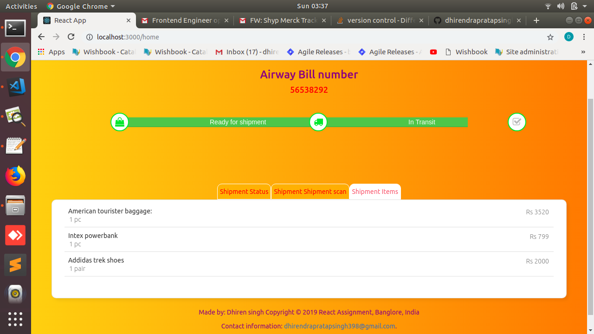

### `Dependencies/Libraries used `

[React JS(UI)](https://reactjs.org/docs/getting-started.html),
[axios( http API Calls)](https://www.npmjs.com/package/axios),
[Bootstrap3.7](https://maxcdn.bootstrapcdn.com/bootstrap/3.3.7/js/bootstrap.min.js),  
[jQuery3.3](https://ajax.googleapis.com/ajax/libs/jquery/3.3.1/jquery.min.js),
[Fontawsome](https://fontawesome.com/v4.7.0/icons/), 
[MaterializeCSS](https://materializecss.com/getting-started.html),
[reactRouter](https://www.npmjs.com/package/react-router-dom)
[npm](https://www.npmjs.com/)
[auth0](https://auth0.com/docs)

### `Steps to create Project & add all dependencies in Ubntu18.04>`

`shortcut way is just download whole project install npm >go inside project directory > npm start`

`Install nodejs npm npx`  
sudo apt update 
sudo apt install nodejs npm 
sudo apt install npm 

npm install -g npx 
npx create-react-app [react-app/YourAppName] 
cd react-app 
npm start 

Then open http://localhost:3000/ to see your app. 
stop ctrl+c to add dependencies

`Libraries & framework`  

npm install axios 
npm install --save react-router-dom 
npm install auth0 

npm install jquery --save

The following cdns are included in index.html via scipt/links
[Bootstrap3.7](https://maxcdn.bootstrapcdn.com/bootstrap/3.3.7/js/bootstrap.min.js),
[jQuery3.3](https://ajax.googleapis.com/ajax/libs/jquery/3.3.1/jquery.min.js),
[Fontawsome](https://fontawesome.com/v4.7.0/icons/), 
[MaterializeCSS](https://cdnjs.cloudflare.com/ajax/libs/materialize/1.0.0/css/materialize.min.css) 

replace src folder in react-app with my src folder to get code & resources 

npm start 
open http://localhost:3000/ to run app again.

The build is minified and the filenames include the hashes. 
Your app is ready to be deployed!

### `Auth0 Authorization Credentials`

Impemented User Sign in page(Authorizartion via integrating .[auth0](https://auth0.com/docs) )
Auth0 provides authentication and authorization as a service to make application secure

`email -testdhirensapp@react.com` 
`password-  123456789@Dps`

## Features

1. Impemented User Sign in page(Authorizartion via .auth0 )Auth0 provides authentication and authorization as a service to make application secure.
2. Implemented  Routing mechanism- Navigation to different pages
3. Navigation bar
4. List of cards- in Home tab
5. Delete action- icon on top right of each button
6. Add actiom: bottom right of Home window
7. Implemented Modals on both actions.
8. Search action with -ve handling
9. Bi-directional Sort action- beside page title
10. Card Details page
11. mock API used calls for actions- https://jsonplaceholder.typicode.com/
12. Loader effect for async transitions 
13. Full Responsiveness compatiblity with mobile
14. Post list page with animation clicking on any post opens Post Details fetched via API call
15. My Portfolio 
16. Implemented React portal usage

This project was bootstrapped with [Create React App](https://github.com/facebook/create-react-app).

### `npm start`

Runs the app in the development mode. 
Open [http://localhost:3000](http://localhost:3000) to view it in the browser.

The page will reload if you make edits. 
You will also see any lint errors in the console.

