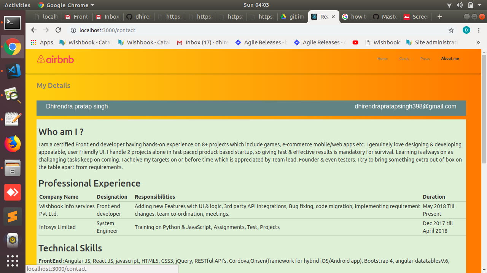

### `Dependencies/Libraries used `

[React JS(UI)](https://reactjs.org/docs/getting-started.html),
[axios( http API Calls)](https://www.npmjs.com/package/axios),
[Redux( satate management)](https://redux.js.org/introduction/getting-started),
[Bootstrap3.7](https://maxcdn.bootstrapcdn.com/bootstrap/3.3.7/js/bootstrap.min.js),  
[jQuery3.3](https://ajax.googleapis.com/ajax/libs/jquery/3.3.1/jquery.min.js),
[Fontawsome](https://fontawesome.com/v4.7.0/icons/), 
[Materialize](https://materializecss.com/getting-started.html),
[reactRouter](https://www.npmjs.com/package/react-router-dom)
[npm](https://www.npmjs.com/)
[auth0](https://auth0.com/docs)

### `Steps to create Project & add all dependencies in Ubntu18.04>`

`shortcut way is just download whole project install npm >go inside project directory > npm start`

`Install nodejs npm npx`  
sudo apt update 
sudo apt install nodejs npm 
sudo apt install npm 

npm install -g npx 
npx create-react-app [react-app/YourAppName] 
cd react-app 
npm start 

Then open http://localhost:3000/ to see your app. 
stop ctrl+c to add dependencies

`Libraries & framework`  

npm install axios 
npm install --save react-router-dom 
npm install redux react-redux 
npm install auth0 

npm install jquery --save

The following cdns are included in index.html via scipt/links
[Bootstrap3.7](https://maxcdn.bootstrapcdn.com/bootstrap/3.3.7/js/bootstrap.min.js),
[jQuery3.3](https://ajax.googleapis.com/ajax/libs/jquery/3.3.1/jquery.min.js),
[Fontawsome](https://fontawesome.com/v4.7.0/icons/), 
[MaterializeCSS/Js](https://cdnjs.cloudflare.com/ajax/libs/materialize/1.0.0/css/materialize.min.css) 

replace src folder in react-app with my src folder to get code & resources 

npm start 
open http://localhost:3000/ to run app again.

The build is minified and the filenames include the hashes. 
Your app is ready to be deployed!

### `Auth0 Authorization Credentials`

Impemented User Sign in page(Authorizartion via integrating .[auth0](https://auth0.com/docs) )
Auth0 provides authentication and authorization as a service to make application secure

`email -testdhirensapp@react.com` 
`password-  123456789@Dps`

### Features

1. Impemented User Sign in page(Authorizartion via .auth0 )Auth0 provides authentication and authorization as a service to make application secure.
2. Implemented  Routing mechanism- Navigation to different pages
3. Navigation bar
4. Home page with tab swithing & progressbar

5. List of cards- in Cards tab
6. mock API used calls for actions- https://jsonplaceholder.typicode.com/
7. Implemented Redux store for central state mananagement on C.U.R.D operations
8. Implemented React portal usage
9. Delete action- icon on top left of each card
10. Edit action- icon on top right of each card
11. Add action: bottom right of Home window
12. Implemented Modals on all actions.
13. Search action with -ve handling
14. Bi-directional Sort action- beside page title
15. Card Details page when clicked on image
16. View full size action
17. Loader effect for async transitions 
18. Full Responsiveness compatiblity with mobile
19. Left sliding menu for mobile

20. Post list page with animation clicking on any post opens Post Details fetched via API call

21. My Portfolio 

This project was bootstrapped with [Create React App](https://github.com/facebook/create-react-app).

### `npm start`

Runs the app in the development mode. 
Open [http://localhost:3000](http://localhost:3000) to view it in the browser.

The page will reload if you make edits. 
You will also see any lint errors in the console.

### `Priviews`

<!--  -->

<!-- 

 -->
Login page

Home Bill details tabs & Delivery status progress

sliding Menu for mobile phones

Cards

Sort Cards in Ascending, Descending, Back to original list

Search card

Edit carddetails

Delete card

Add new card

Ipad/ Mobile layouts

Card Details

Actions view ful size

Loader

Auto Pagination on scroll

Negative search handling

Post list Responsive layouts

Post Details

Contact- CV/Portfolio 

